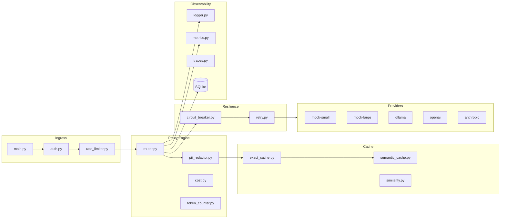

# RouteWise Architecture

## Overview

RouteWise is a FastAPI application that exposes an OpenAI-compatible API surface while orchestrating provider calls through a policy engine with caching, resilience, and observability layers.

## Component diagram



## Request lifecycle

1. **Authentication** — `X-API-Key` validated against `DEMO_API_KEY`
2. **Rate limiting** — per-key sliding window (in-memory or Redis)
3. **PII redaction** — applied to messages before cache lookup and logging
4. **Cache lookup** — exact hash first, then semantic similarity
5. **Routing** — explicit model or auto policy based on complexity
6. **Execution** — circuit breaker + exponential backoff retry
7. **Fallback** — on failure, try fallback chain ending at mock-small
8. **Persistence** — redacted hash + metadata to SQLite
9. **Metrics** — Prometheus counters/histograms updated
10. **Response** — OpenAI-compatible JSON with gateway enrichments

## Provider abstraction

All providers implement `BaseProvider`:

```python
async def complete(messages, temperature) -> ProviderResult
async def health_check() -> bool
def estimate_cost(prompt_tokens, completion_tokens) -> float
```

`ProviderRegistry` registers mock providers always; optional providers (Ollama, OpenAI, Anthropic) are added at startup if credentials/health checks pass.

## Cache design

### Exact cache

- Key: SHA-256 of normalized prompt + model scope
- Value: response payload + route metadata
- TTL: configurable (`EXACT_CACHE_TTL_SECONDS`)
- Backend: in-memory dict or Redis

### Semantic cache

- Embedding: `sentence-transformers/all-MiniLM-L6-v2`
- Similarity: cosine similarity via scikit-learn
- Threshold: `SEMANTIC_SIMILARITY_THRESHOLD` (default 0.92)
- PII prompts: excluded from semantic store/lookup

## Circuit breaker states

| State | Behavior |
|-------|----------|
| closed | Normal operation |
| open | Reject calls after N failures; cooldown period |
| half_open | Allow probe request; success → closed, failure → open |

State exported to `data/circuit_state.json` for dashboard consumption.

## Configuration reference

See `.env.example` for all settings. Key groups:

- **Auth**: `DEMO_API_KEY`
- **Budgets**: `DAILY_BUDGET_USD`, `MONTHLY_BUDGET_USD`, `BUDGET_EXCEEDED_ACTION`
- **Cache**: `SEMANTIC_CACHE_ENABLED`, `SEMANTIC_SIMILARITY_THRESHOLD`
- **Providers**: `OLLAMA_BASE_URL`, `OPENAI_API_KEY`, `ANTHROPIC_API_KEY`
- **Resilience**: `CIRCUIT_FAILURE_THRESHOLD`, `MOCK_FAILURE_RATE`

## Extension points

1. **New provider** — implement `BaseProvider`, register in `ProviderRegistry`
2. **Custom routing** — extend `decide_route()` in `router.py`
3. **Cache backend** — implement same interface as `ExactCache`
4. **Judge** — replace deterministic rubric in `evaluation/judge.py`

## Data model

`request_logs` table stores per-request metadata without raw prompt text:

- trace_id, model_requested, model_used, route_reason
- cache_status, tokens, cost, latency
- feature (from metadata), provider, redacted_prompt_hash

## Evaluation pipeline

```
prompt_suite.jsonl → evaluator.py → gateway API → judge.py → evaluation_results.md
```

Three modes per prompt measure cost, latency, cache effectiveness, and quality.
