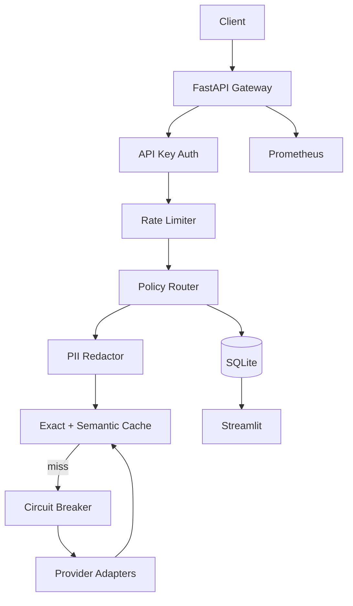

# RouteWise — OpenAI-Compatible Multi-Model LLM Gateway

RouteWise is a **production-style AI infrastructure gateway**, not a chatbot. It sits in front of multiple LLM providers and adds routing, semantic caching, fallbacks, cost tracking, rate limiting, circuit breakers, PII redaction, and observability — all behind an OpenAI-compatible `/v1/chat/completions` API.

## What problem this solves

Direct LLM API calls are not production-ready on their own. Teams typically need:

- **Multi-provider routing** with intelligent model selection
- **Cost control** via budgets, tracking, and cheaper fallbacks
- **Reliability** via retries, circuit breakers, and provider fallbacks
- **Latency optimization** via exact and semantic caching
- **Security** via API keys, rate limits, and PII redaction in logs
- **Observability** via metrics, traces, and an admin dashboard

RouteWise demonstrates all of these patterns in a single runnable local gateway.

## Why direct LLM calls are not production-ready

| Gap | RouteWise solution |
|-----|-------------------|
| No cost visibility | Per-request token/cost tracking + budgets |
| Single provider lock-in | Pluggable adapters + auto routing |
| No resilience | Circuit breakers, retries, fallbacks |
| Repeated prompts waste money | Exact + semantic cache |
| PII in logs | Regex redaction before persistence |
| No SLO monitoring | Prometheus metrics + Streamlit dashboard |

## Architecture



See [ARCHITECTURE.md](ARCHITECTURE.md) for component-level detail.

## Quickstart

> **Note:** If your project path contains `:` (e.g. `AI:ML`), Python cannot create `.venv` in-place. `make setup` automatically creates the venv at `~/.venvs/routewise-gateway` and symlinks `.venv`.

```bash
cd routewise-gateway
cp .env.example .env
make setup
make run          # http://localhost:8000
make dashboard    # http://localhost:8501 (separate terminal)
```

Default demo runs with **mock providers only** — no paid API keys required.

## API examples

### Health check

```bash
curl http://localhost:8000/health
```

### Auto route

```bash
curl -X POST http://localhost:8000/v1/chat/completions \
  -H "Content-Type: application/json" \
  -H "X-API-Key: demo-key-change-me" \
  -d '{
    "model": "auto",
    "messages": [{"role": "user", "content": "Summarize REST APIs in one sentence."}],
    "temperature": 0.2,
    "metadata": {"feature": "demo"}
  }'
```

### Cache warm (repeat same prompt)

```bash
# Second identical request returns cache_status: exact_hit
curl -X POST http://localhost:8000/v1/chat/completions \
  -H "Content-Type: application/json" \
  -H "X-API-Key: demo-key-change-me" \
  -d '{
    "model": "auto",
    "messages": [{"role": "user", "content": "Summarize REST APIs in one sentence."}]
  }'
```

### List models

```bash
curl -H "X-API-Key: demo-key-change-me" http://localhost:8000/v1/models
```

### Metrics

```bash
curl http://localhost:8000/metrics
```

## Routing policy

When `model` is **explicit** (`mock-small`, `mock-large`, `ollama`, `openai`, `anthropic`), RouteWise routes directly to that provider (with fallback on failure).

When `model` is **`auto`**:

1. Redact PII from prompt text
2. Check exact cache, then semantic cache
3. Estimate prompt complexity (token count, code blocks, length)
4. Route simple prompts → `mock-small`
5. Route moderate prompts → `mock-large`
6. Route complex prompts → premium provider if configured
7. On budget exceeded → downgrade to `mock-small` or reject (configurable)
8. On provider failure → fallback chain with circuit breaker

Every response includes `route_reason` explaining the decision.

## Cache correctness

- **Exact cache**: normalized prompt hash — safe for identical queries
- **Semantic cache**: embedding similarity ≥ threshold (default 0.92)
- **PII prompts are never semantically cached** to prevent unsafe cross-user hits
- Cache returns `cache_confidence` for semantic hits
- Original route metadata is stored with cache entries

## Makefile commands

| Command | Description |
|---------|-------------|
| `make setup` | Create `.venv` and install dependencies |
| `make run` | Start FastAPI gateway on port 8000 |
| `make dashboard` | Start Streamlit dashboard on port 8501 |
| `make test` | Run pytest suite |
| `make demo` | Run demo requests script |
| `make eval` | Run evaluation pipeline |
| `make load-test` | Run load benchmark |
| `make clean` | Remove venv and caches |

## Evaluation methodology

The evaluation suite (`data/prompt_suite.jsonl`, 32 prompts) tests three modes:

1. **direct_expensive** — always `mock-large`
2. **auto_route** — policy-based routing
3. **cache_warm** — repeated prompts for cache measurement

Metrics: cost per 1K requests, p50/p95 latency, cache hit rate, fallback rate, quality score (deterministic keyword rubric).

Run: `make eval` (gateway must be running).

## Dashboard

The Streamlit dashboard shows:

- Request volume and latency distribution
- Route/provider breakdown
- Cache hit rate and cost by model
- Feature breakdown from request metadata
- Circuit breaker state
- Evaluation results table

## Security and privacy

- API key required via `X-API-Key` header
- No secrets committed; use `.env` (see `.env.example`)
- PII redacted before logging (email, phone, SSN, card patterns)
- Raw prompts are **not** stored in SQLite — only hashes
- Admin endpoints require the same API key

## Limitations

- Streaming (`stream: true`) not supported in v1
- Semantic cache uses in-memory embeddings by default (Redis optional for exact cache/rate limits)
- Quality evaluation uses a deterministic rubric, not an LLM judge
- Mock providers simulate latency/quality, not real inference
- Single-node SQLite — not horizontally scalable without changes

## Production hardening roadmap

- [ ] JWT/OAuth2 with per-tenant budgets
- [ ] Distributed Redis cache with cache key namespacing
- [ ] OpenTelemetry distributed tracing
- [ ] PostgreSQL + read replicas for analytics
- [ ] Kubernetes Helm chart with HPA
- [ ] Prompt injection detection
- [ ] A/B routing experiments
- [ ] Real-time budget alerts (PagerDuty/Slack)

## License

MIT
